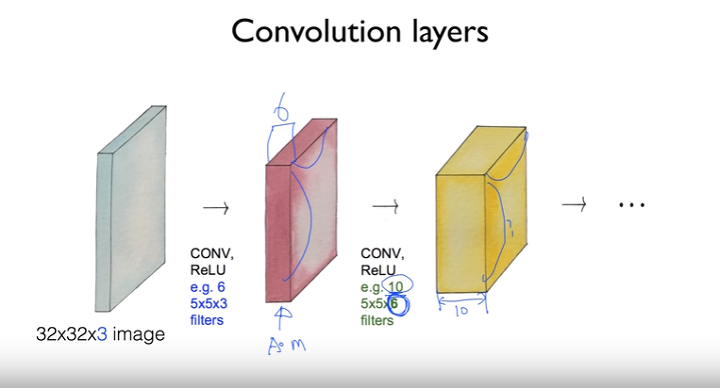
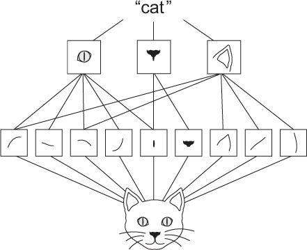

# 5.1. Introduction to convnet
convnet(convolutional neural networks)의 전체 구조는 다음 그림과 같은 구조로 이루어져 있다  
고양이가 한 물체를 보았을 때 뇌의 한부분만 반응하는 것에 착안한 모델이라고 한다.
아직은 잘 모르지만, 그림을 보면 conv, relu는 한 쌍으로 구성되어 있는 것을 볼 수 있다.  
아래 그림은 "자동차"그림을 "자동차"로 인식하기 위한 CNN인데, Convolution으로는 각각 다른 자동차이미지들로 구성되어있는 것을 볼수 있다.
<left></left> 

### CONV, RELU, POOL에 관한 간단한 정리  
<left></left>

CONV 는 한 이미지에서의 필터를 적용해서 얻은 데이터를 의미한다.
예를 들어 32x32x3(width, height, depth)의 이미지에서 stride를 옮겨가면서 filter를 적용한 값을 의미한다.
RELU라는 것은 함수와 비슷한 개념인데, Wx+b와 같은 식을 적용하는 함수와 같은 것으로 보인다.
(참고)
neural network의 layer는 보통 입력값을 가지고 있는데 이것을 vecotr라고 부르고 weight matrix를 곱한다..
https://stackoverflow.com/questions/43504248/what-does-relu-stand-for-in-tf-nn-relu

POOL 은 sampling, resizing을 의미하고, 여러가지 방법이 있지만 max pooling이라는 방법을 주로 쓴다

#### 다시 책으로 돌아와서
convnet은 입력 텐서의 형태 (image_height, image_width, image_channels)(배치 차원을 포함하지 않음)를 취한다.
~~~python
from keras import layers
from keras import models

model = models.Sequential()
model.add(layers.Conv2D(32, (3, 3), activation='relu', input_shape=(28, 28, 1)))
model.add(layers.MaxPooling2D((2, 2)))
model.add(layers.Conv2D(64, (3, 3), activation='relu'))
model.add(layers.MaxPooling2D((2, 2)))
model.add(layers.Conv2D(64, (3, 3), activation='relu'))
~~~  

~~~
>>> model.summary()
________________________________________________________________
Layer (type)                     Output Shape          Param #
================================================================
conv2d_1 (Conv2D)                (None, 26, 26, 32)    320
________________________________________________________________
maxpooling2d_1 (MaxPooling2D)    (None, 13, 13, 32)    0
________________________________________________________________
conv2d_2 (Conv2D)                (None, 11, 11, 64)    18496
________________________________________________________________
maxpooling2d_2 (MaxPooling2D)    (None, 5, 5, 64)      0
________________________________________________________________
conv2d_3 (Conv2D)                (None, 3, 3, 64)      36928
================================================================
Total params: 55,744
Trainable params: 55,744
Non-trainable params: 0
~~~

앞에서 본것과 같이 Conv와 pooling layer가 반복되고 있는 것을 볼 수 있다.
tensorflow에서는 필터의 크기를 사용자가 직접 계산하고 필터의 갯수도 직접 지정하는 것으로 보이는데
keras의 경우는 필터의 크기를 알아서 계산해 주는 것으로 보인다.

### 5.1.1. 컨벌루션 연산
조밀하게 연결된 레이어와 컨볼 루션 레이어의 근본적인 차이점은 다음과 같습니다. Dense레이어는 입력 특징 공간에서 전체 패턴을 학습합니다 (예 : MNIST 숫자, 모든 픽셀을 포함하는 패턴).  
반면에 컨볼 루션 레이어는 **로컬 패턴**을 학습합니다 ( 그림 5.1 참조 ) : 이미지의 경우 입력의 작은 2D 창에서 발견되는 패턴. 이전 예에서이 창은 모두 **3 × 3**이었습니다.

###### 그림 5.1.
<left></left> 

그들은 패턴의 공간 계급을 배울 수있다 ( 그림 5.2 참조 ). 첫 번째 컨볼 루션 계층은 가장자리와 같은 작은 로컬 패턴을 학습하고, 두 번째 컨볼루션 계층은 첫 번째 계층의 기능으로 만들어진 더 큰 패턴을 학습하는 등의 작업을 수행합니다. 이것은 convnets이 점점 더 복잡하고 추상적인 시각적 개념을 효율적으로 학습하도록 합니다 (시각적 세계는 근본적으로 공간적으로 계층적이기 때문에)

<left></left> 

컨볼 루션 은 두 개의 공간 축 ( 높이 와 너비 )과 깊이 축 ( 채널 축 이라고도 함)이있는 피쳐 맵 이라는 3D 텐서를 통해 작동합니다 . RGB 이미지의 경우 깊이 축의 크기는 3입니다. 이미지에 빨강, 녹색 및 파랑의 세 가지 색상 채널이 있기 때문입니다. 흑백 사진의 경우 MNIST 숫자와 마찬가지로 깊이는 1 (회색 레벨)입니다.  

컨볼 루션 연산은 입력 특성 맵에서 패치를 추출하고 모든 패치에 동일한 변환을 적용하여 출력 특성 맵을 생성합니다.

 이 출력 특성 맵은 여전히 ​​3D 텐서입니다 : 너비와 높이를가집니다. 출력 깊이가 레이어의 매개 변수이기 때문에 깊이는 임의적 일 수 있습니다
 

# 5.2. Training a convnet from scratch on a small datasheet

# 3. Using a pre-trained convnet

# 4. Visualizing what convnet learn
