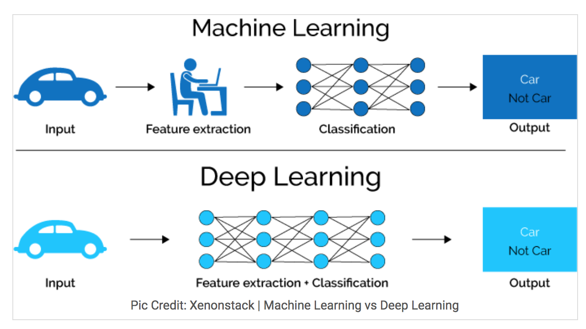
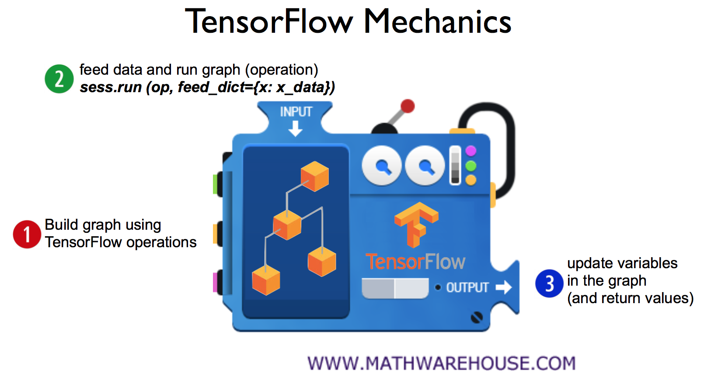

# 1. 머신러닝의 개념과 용어

AI(Artificial Intelligence), 프로그램..
프로그램이란 input에 대한 out을 출력하는 것이 프로그램이다..
AI는 정해진 input에 대한 out을 예측할 수 있어야 한다.
input에 대한 out을 예측할 수 있도록, 수 많은 데이터를 학습해서 예측할 수 있도록 해주는 것이 머신러닝이다.
프로그램인데, 이것을 개발자가 어떻게 할지를 정하는 것이 아니라, 프로그램이 데이터를 통해 학습해서
스스로 배우는 영역을 머신러닝이라고 한다.
그리고 이런 머신러닝의 여러 방법 중 하나가 신경망 이론을 이용한 딥러닝이라는 것이다.
<left></left>

# 텐서플로 기본 용어
https://www.tensorflow.org/guide/graphs
https://docs.google.com/presentation/d/137IlT2N3AYcclqxNuc8j9RDrIeHiYkSZ5JPg_vg9Jqk/edit#slide=id.g1d115b0ec5_0_32

노드는 수학적인 연산을 의미하며 아래 그림의 동그란 것들이 노드에 해당한다.
엣지는 간선을 의미하는데 데이터 어레이를 의미한다.. 쉽게 말해 데이터 셋을 의미하는 듯하다.

<left></left>

# node, session이란..
node는 앞에서의 설명과 같이 operation을 의미한다... 특정한 상수가 될수 도 있는 것으로 보인다.
특정한 상수 대신 실행 중에 입력을 받고 싶으면 placeholder라는 것을 사용한다고 한다.  
session 이란 위에서 노드들을 감싸고 있는 네모 박스들과 같은 역할을 의미하는 것으로 보인다.
실행 중에도 데이터를 입력받아서 어떤 값일지 예측할 수 있도록 해주는 노드와 간선들로 이루어진 모델인 듯 하다.
<left></left>

~~~python
# node(operation)
hello = tf.constant("hello tensorflow")
# start session
sess = tf.Session()
# run op and get result
print(sess.run(hello))
~~~

아래 예제에서는 node1, node2, node3모두 node이다.
node1, node2는 상수 노드이고, node3은 더하는 연산의 노드가 된다.

~~~python
node1 = tf.constant(3.0, tf.float32)
node2 = tf.constant(4.0, tf.float32)
node3 = tf.add(node1, node2)
~~~

# place holder
adder_node에 session을 run시킬 때 feed_dict로 a와 b의 값을 넣어주고 있다..
여기에 들어가는 값들은 엑셀파일에 정의되어있는 수치일 수도 있고 특정 기간 동안 센서 등을 통해 수집된 데이터일 수도 있을 것이다.
어쨌든 중요한 것은 실행 중에 입력값을 넣어 줄 수 있다는 것인듯..
(feed_dict, 이름 잘지은 듯 하다. 먹이로 주는 데이터?)
~~~python
a = tf.placeholder(tf.float32)
b = tf.placeholder(tf.float32)
adder_node = a+b

print(sess.run(adder_node, feed_dict = {a:3, b: 4.5}))
print(sess.run(adder_node, feed_dict = {a: [1,3], b: [2,4]}))
#7.5
#[3. 7.]
~~~

<left></left>

