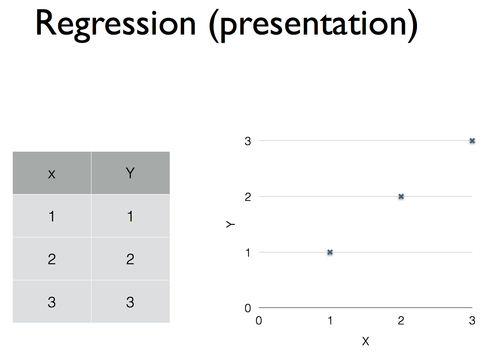
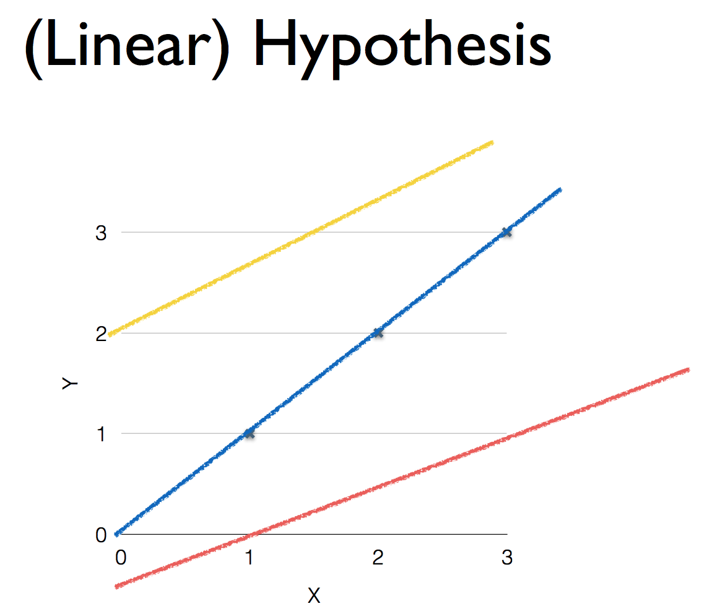
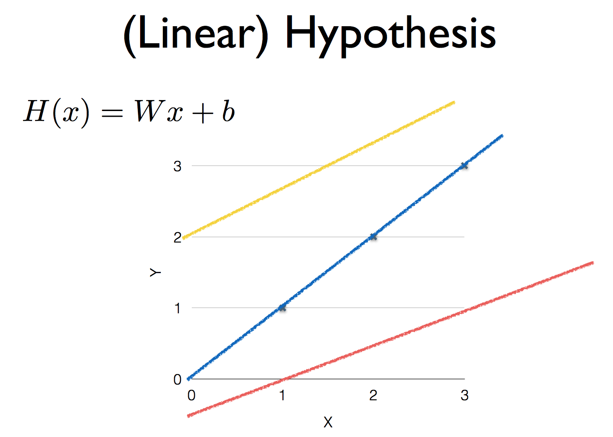
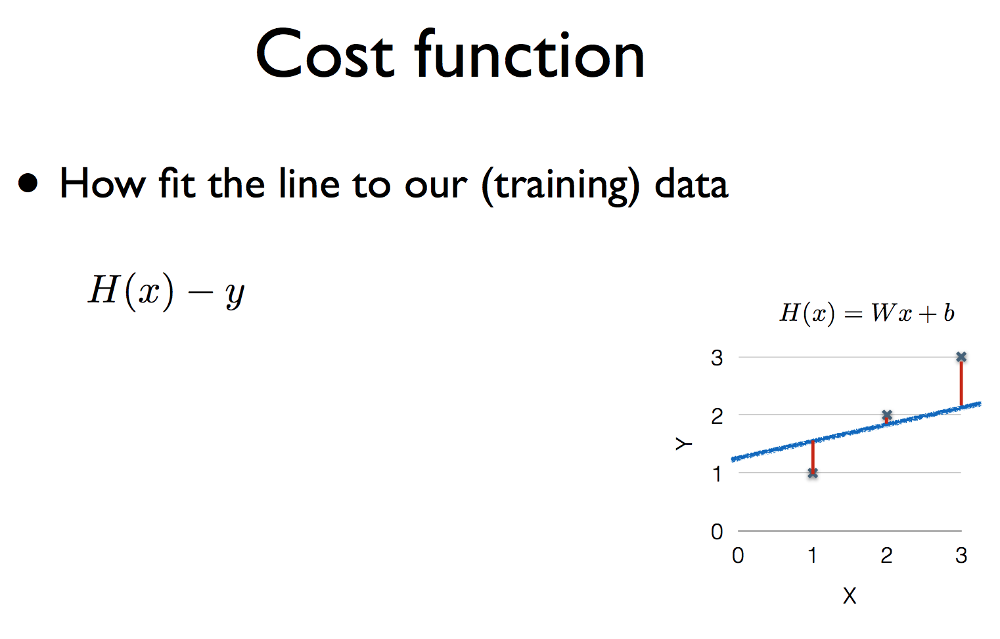
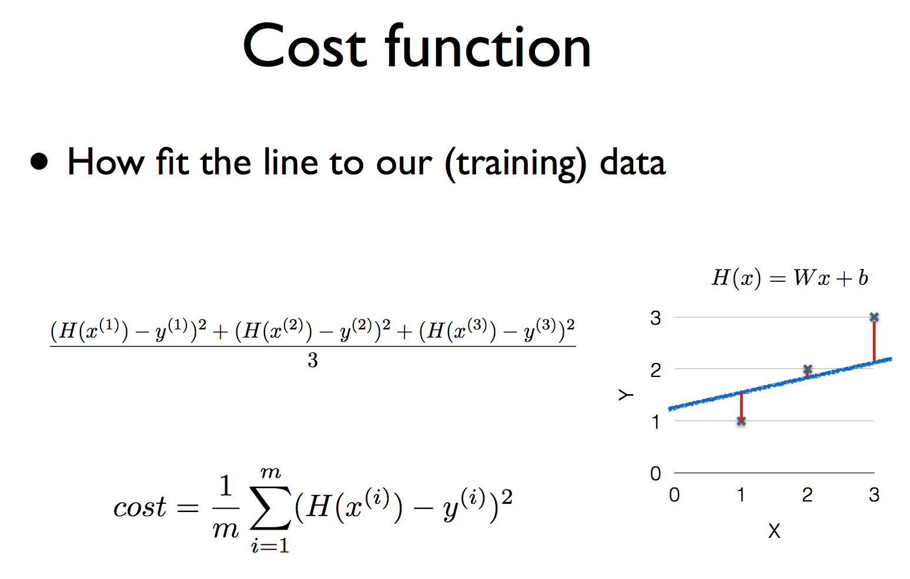
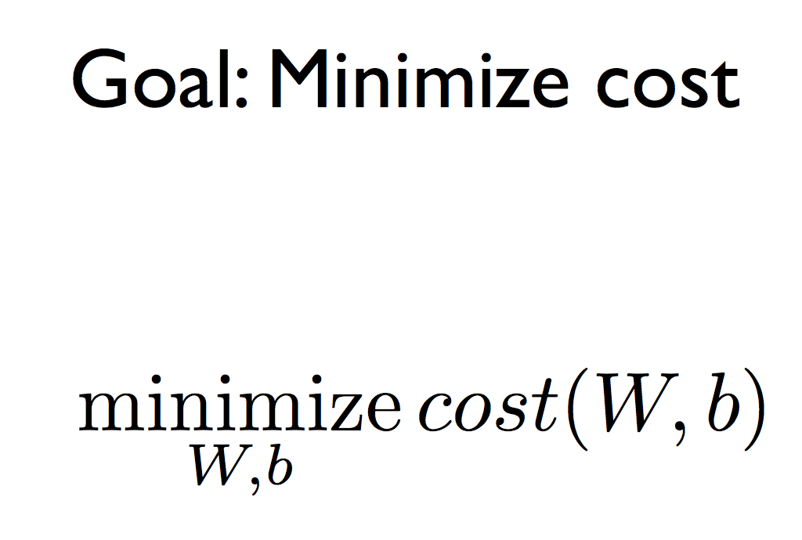

# Linear Regression의 개념

아래와 같은 data가 있다고 해보자.  
<left></left>

그럼 이 data에 대한 가설(H(x))은 다음과 같을 것이다.  
<left></left>

이 데이터에 대한 그래프와 식은 다음과 같을 것이다.  
그리고 다른 데이터들에 대한 식은 노란색과 빨간색 선들이라고 해보자.  
<left></left>

이 때 어떤 식이 더 좋은지에 대해 판단할 수 있어야 한다..  
이때 사용하는 것이 비용함수라는 것이다.  
<left></left>

비용함수라는 것은 가설과 실제 데이터의 차가 얼마나 되는지를 의미하는 것이다.  
<left></left>

이 그래프의 전체 비용함수를 구하면 다음과 같을 것이다.  
<left></left>

결국, 주어지는 data(앞에서의 표)들에 대한 좋은 가설을 얻기 위해서는 기울기와 절편을 움직이면서 비용함수에 대한 값이 적게 나오는 가설을 선택하면 될 것이다..  
<left></left>
