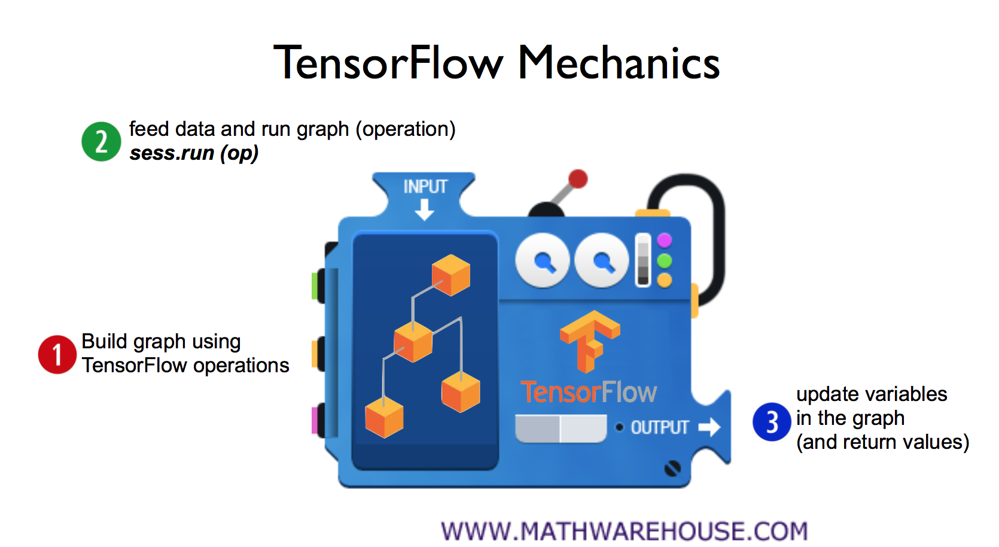

~~~
이 포스트는 홍콩과기대 김성훈 교수님 강의내용을 개인적으로 이해한대로 정리한 내용입니다.  
개인적인 호기심으로? 스터디한 내용을 정리한 포스팅입니다.  
틀린 부분이 있을 수 있으니 감안하시길 .. 아래 사이트에 강의 내용이 있습니다.
~~~
[모두를 위한 딥러닝 강의](http://hunkim.github.io/ml/)  
[모두를 위한 딥러닝 깃허브](https://github.com/hunkim/DeepLearningZeroToAll)  

# 개요
앞에서 살펴본 비용함수라는 것은 가설이 실제 데이터와 얼마나 차이나는지 확인하는 방법이다.  
가설을 변화시켜가면서 비용함수의 값을 최소화 시키게 되면, 실제 데이터를 통해서 다음 데이터는 어떤 값을 갖게 될지 예측을 할 수 있다.  
최적의 비용함수를 찾기 위한 방법 중 하나가 기울기와 절편을 변화시켜 가면서 찾는 방법인데, 이를 경사하강법(gradiant descent)이라고 한다.  
그런데 텐서플로에서는 미분 등의 식을 통해 경사하강법을 직접 구현하지 않아도 텐서플로 패키지 내의 함수를 통해서 구현할 수 있다.  
텐서플로의 함수를 사용하지 않고 직접 구현하는 방법은 다음에 확인해보기로 하고 우선 텐서플로에서 제공해주는 경사하강법의 사용 예를 살펴보자..  

# 텐서플로 구현  

대부분의 구현 방법은 아래 그림과 같다. 1: graph(연산, node, 들을 선언및 초기화)를 build하고, 2. 실제 축적되어있는 data(통계치등)를 넣어서 실행을 시킨다. 3.실행의 결과의 값들을 update한다..  
<left></left>

# W, b 값 부여(weight, bias) 및 가설  

Variable이라는 것은 프로그래밍 언어에서 사용하는 변수와는 조금 다른 텐서플로에서 사용하는 변수 비슷한 개념인데,  
tensorflow가 학습하면서 변경을 시킬 수 있는, 훈련시킬수 있는 Variable이라고 한다.  
그리고 random_normal함수는 random함수를 의미하고 아래 코드에서는 1차원의 random함수를 통해 w, b값을 선언했다  
hypothesis라는 node를 선언하고 wx+b로 node를 초기화했다  

~~~python
W = tf.Variable(tf.random_normal([1]), name='weight')  
b = tf.Variable(tf.random_normal([1]), name='bias')  

#Our hypothesis XW+b
hypothesis = x_train * W + b
~~~

# 비용함수

앞에서 봤던 것과 같이 비용함수는 (H(x)-y)^2 가된다. reduce_mean은 평균을 구하는 함수라고 한다.(i를 1~m까지 증가시킨 값을 1/m)  

~~~python
#cost/loss function
cost = tf.reduce_mean(tf.square(hypothesis - y_train))
~~~

# 최적의 비용함수 찾기

최적의 비용함수를 찾기 위한 방법 중의 하나가 경사하강법(gradiant descent)라는 것인데, tensorflow에서는 아래와 같이 경사하강법을 쉽게 사용할 수 있는 벙법을 제공해주고 있다.  

코드를 보면 경사하강법을 사용하는 optimizer를 선언하고 optimizer의 minimize함수를 호출하면서 cost(비용함수)를 최소화시키고 이를 train이라는 노드로 초기화 한다.  

~~~python
#Minimize
optimizer = tf.train.GradientDescentOptimizer(learning_rate=0.01)
train = optimizer.minimize(cost)
~~~

노드라는 것은 앞에서 봤던 트리 형태의 동그란 부분, 즉 연산을 의미한다고 보면 될 것 같다.  
여기까지가 그래프를 building하는 과정이다.  
그리고 그래프를 동작시켜서 값을 찾는 과정은 다음과 같다.  

~~~python
sess.run(train)
~~~

전체 예제 코드는 다음과 같다..  
~~~python
#Lab 2 Linear Regression
import tensorflow as tf
tf.set_random_seed(777)  # for reproducibility  

#X and Y data  
x_train = [1, 2, 3]  
y_train = [1, 2, 3]
 
#Try to find values for W and b to compute y_data = x_data * W + b
#We know that W should be 1 and b should be 0
#But let TensorFlow figure it out
W = tf.Variable(tf.random_normal([1]), name='weight')
b = tf.Variable(tf.random_normal([1]), name='bias')
 
#Our hypothesis XW+b
hypothesis = x_train * W + b
 
#cost/loss function
cost = tf.reduce_mean(tf.square(hypothesis - y_train))
 
#Minimize
optimizer = tf.train.GradientDescentOptimizer(learning_rate=0.01)
train = optimizer.minimize(cost)
 
#Launch the graph in a session.
sess = tf.Session()
#Initializes global variables in the graph.
sess.run(tf.global_variables_initializer())
 
#Fit the line
for step in range(2001):
    sess.run(train)
    if step % 20 == 0:
        print(step, sess.run(cost), sess.run(W), sess.run(b))
 
#Learns best fit W:[ 1.],  b:[ 0.]
 
'''
0 2.82329 [ 2.12867713] [-0.85235667]
20 0.190351 [ 1.53392804] [-1.05059612]
40 0.151357 [ 1.45725465] [-1.02391243]
...
1920 1.77484e-05 [ 1.00489295] [-0.01112291]
1940 1.61197e-05 [ 1.00466311] [-0.01060018]
1960 1.46397e-05 [ 1.004444] [-0.01010205]
1980 1.32962e-05 [ 1.00423515] [-0.00962736]
2000 1.20761e-05 [ 1.00403607] [-0.00917497]
'''
~~~
