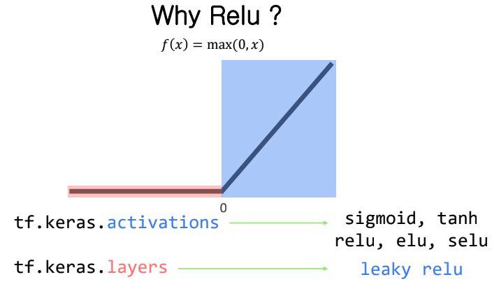

# Relu

이진 분류 문제를 해결하기 위해 Sigmoid를 activation function로 사용했고

다중 분류 문제를 위해 Softmax를 사용했다.

그런데 이전의 모델과는 다르게 neural network를 사용할 경우, back proagation을 반복하면서 gradient값이 점점 작아지는 문제가 있다. 

relu에 대해 살펴보기 전에 먼저 Sigmoid의 문제점에 대해 먼저 살펴보자.

## Sigmoid의 문제점

Sigmoid의 경우 back propogation을 반복하면서 gradient 값이 점점 작아져 사라지는 문제가 있다. (vanishing gradient)

이를 해결하기 위한 activation function으로 relu라는 것이 있다.

아래 그림을 보면 시그모이드 그래프 중 빨간 부분에서 gradient값이 0에 가까워지고 있다

## Relu

x가 음수일 경우에는 f(x)는 0이 되고 0보다 클 경우에는 이전에 보았던 wx+b 와 같은 형태이고 문제가 되었던 sigmoid의 gradient가 작아지는 부분이 없는 것을 볼 수 있다.

