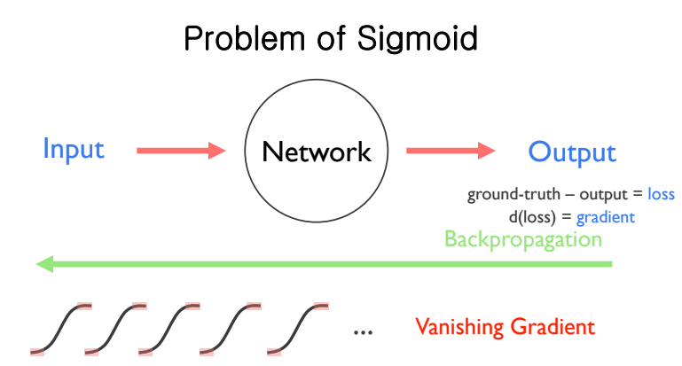
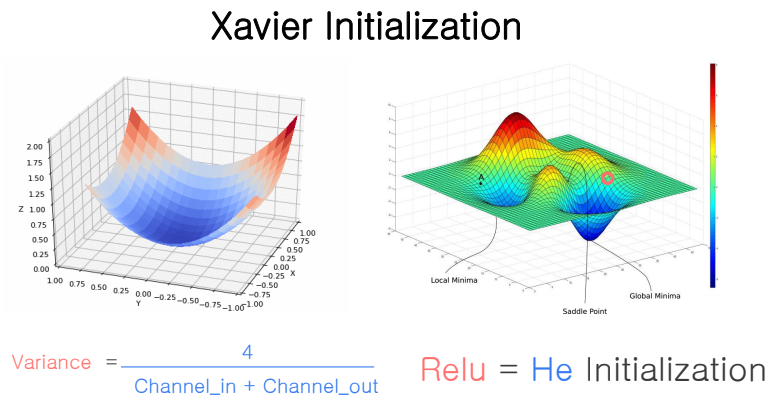
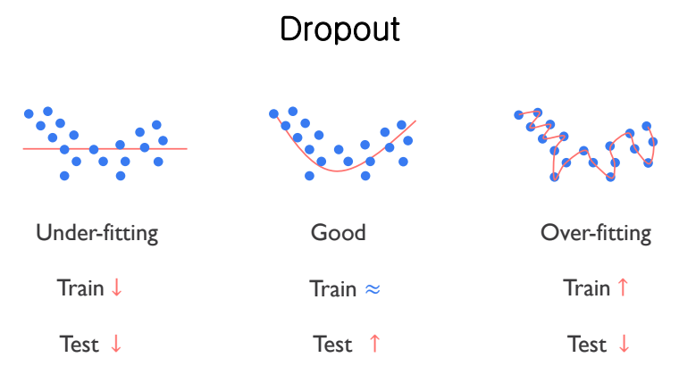
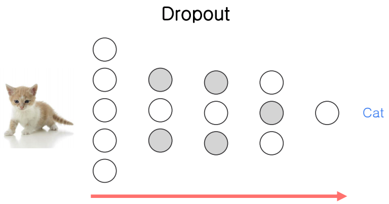
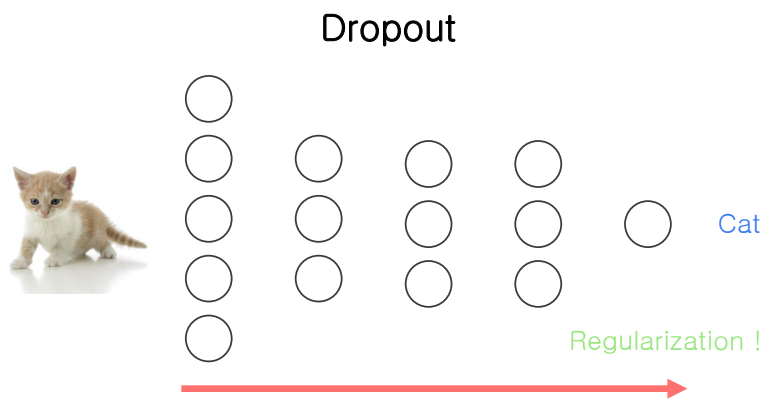

# Relu

이진 분류 문제를 해결하기 위해 Sigmoid를 activation function로 사용했고

다중 분류 문제를 위해 Softmax를 사용했다.

그런데 이전의 모델과는 다르게 neural network를 사용할 경우, back proagation을 반복하면서 gradient값이 점점 작아지는 문제가 있다. 

relu에 대해 살펴보기 전에 먼저 Sigmoid의 문제점에 대해 먼저 살펴보자.

## Sigmoid의 문제점

Sigmoid의 경우 back propogation을 반복하면서 gradient 값이 점점 작아져 사라지는 문제가 있다. (vanishing gradient)

이를 해결하기 위한 activation function으로 relu라는 것이 있다.

아래 그림을 보면 시그모이드 그래프 중 빨간 부분에서 gradient값이 0에 가까워지고 있다

## Relu

x가 음수일 경우에는 f(x)는 0이 되고 0보다 클 경우에는 이전에 보았던 wx+b 와 같은 형태이고 문제가 되었던 sigmoid의 gradient가 작아지는 부분이 없는 것을 볼 수 있다.

## Weight

아래의 우측 그래프를 보면 local minima, global minima가 있다.

Neural network를 학습시키면서 back propagation을 반복하면서 local minima에 빠지지 않고 global minima를 찾을 수 있어야 하는데, 이를 위해 적절한 weight의 초기값을 설정하는 것이 중요하다.

이렇게 weight를 초기화시키기 위한 방법 중의 xavier initialization을 하면 적절하게 weight를 초기화시킬 수 있다.

tensorflow에서는 weight를 initialize하기 위한 방법으로 RandomNormal(), glory_uniform(), he_uniform()함수를 제공해준다. 이후의 예제코드를 통해 확인해보자

## Overfitting, Drop out

보통 모델을 학습 및 평가할 때 data set을 train set, validation set, test set으로 나누어서 학습 및 평가를 한다.

예측을 위해 모델을 학습시킬 때, train set에 과도하게 학습이 될 경우, train set에만 최적화된 예측모델이 되어서 새로운 데이터(test set)에서는 정확도가 낮아지게 된다.

그래서 train set에서는 학습만 시키고 validation set을 통해 모델을 평가해보고 이를 토대로 튜닝한 모델을 학습시킨후 완성된 모델을 test set에서 학습을 시킨다.

train set에서 학습을 시키고 validation set을 통해 평가한 뒤, 모델을 다시 튜닝을 하는데 이때 dropout이라는 것을 사용한다.

아래 그림을 보면 첫번째 그림은 학습이 너무 적게 되어서 모델(직선? 그래프)이 데이터에 적게 fitting된 것을 볼 수 있다. 이를 under fitting이라고 한다.

두번째 그림을 보면, 모델(직선)이 적절하게 학습되었지만 몇몇 개의 데이터들이 그래프의 경계를 벗어나 있는 것을 볼 수 있다. drop out이란 이런 몇몇 개의 데이터를 dropout시키기 위한 방법으로 보인다. tensorflow에서는 랜덤하게 dropout하는 방식을 사용한다.

세번째 그림을 보면 모델이 데이터에 과도하게 학습된 것을 볼 수 있다. 이 경우, train data에서는 좋은 예측을 하지만, 새로운 데이터에서는 좋은 성능을 내지 못하는 문제가 있다.

아래 그림을 보면 고양이 사진을 인식, 분류하기 위한 모델이 있고 overfitting 문제를 해결하기 위해 회색 부분으로 표시된 부분을 제거하게 된다.

이렇게 dropout되고 난 후 regularization이 되었다고 한다.

## Imlementation

dropout을 사용하기 전

~~~ python
class create_model(tf.keras.Model):
  def __init__(self, label_dim):
    super(create_model, self).__init()
    
    weight_init = tf.keras.initializers.glorot_uniform()
    self.model = tf.keras.Sequential()
    
    self.model.add(flatten())# [N, 28, 28, 1] -> [N, 784]
    
    for i in range(2):
      # [N, 784] -> [N, 256] -> [N, 256]
      self.model.add(dense(256, weight_init))
      self.model.add(relu())
      
    self.model.add(dense(label_dim, weight_init))
    
	def call(self, x, training=None, mask=None):
    x = self.model(x)
    
    return x
~~~

dropout을 사용할 경우

~~~python
class create_model(tf.keras.Model):
  def __init__(self, label_dim):
    super(create_model, self).__init__()
    
    weight_init = tf.keras.initializers.glorot_uniform()
    self.model = tf.keras.Sequential()
    
    self.model.add(flatten())# [N, 28, 28, 1] -> [N, 784]
    
    for i in range(2):
      # [N, 784] -> [N, 256] -> [N, 256]
      self.model.add(dense(256, weight_init))
      self.model.add(relu())
      self.model.add(dropout(rate=0.5))
      
    self.model.add(dense(label_dim, weight_init)) #[N, 256] -> [N, 10]
    
    def call(self, x, training=None, mask=None):
      x = self.model(x)
      
      return x
~~~

