# Convolutional Neural Network

[참고]  
https://hunkim.github.io/ml/lec11.pdf  
https://drive.google.com/drive/folders/1twBsdLkI2P15J0DgYs77_E_EVKt7Ghav  

image 분류에 가장 많이 사용되는 분류 방법인데, 뇌가 이미지를 인식하는 방법에서 힌트를 얻었다고 한다.  
아래 그림을 보면, 그림의 한 부분에 대해 인식하는 뇌의 부분이 모두 다른 것을 보여주고 있는데, Convolution neural network도 이와 비슷한 원리로 구현된다.  
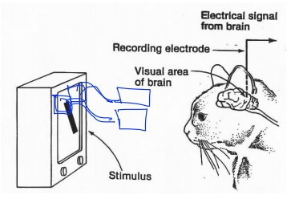

CNN은 기본적으로 Convolution, Pooling, Fully Connected layer로 구성되어 있다.
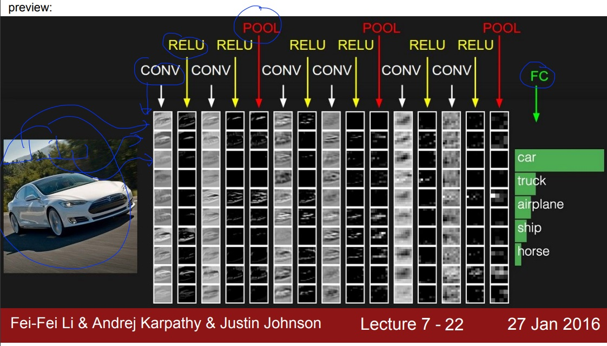  

  
아래 그림의 Convolution, Pooling layer는 특정한 특징을 추출하는 layer이고.(feature extraction)  

Fully connected layer는 분류를 하는 layer이다. (사진이 강아지인지 고양이인지, classification)  
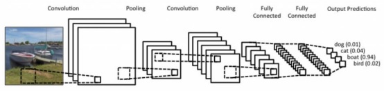  

## Convolution layer
--------

- convolution연산과 filter의 갯수
  filter로 한번의 convolution 연산을 하면 통과하면 하나의 숫자가 나온다.  
  filter를 stride간격으로 input map전체를 순회하고 나면 out map이 나오게 된다.  
  filter의 갯수에 따라 out map의 갯수가 결정되게 되고, 이는 다음 layer의 input map의 갯수가 된다.  
  그림으로 살펴보자.  
  
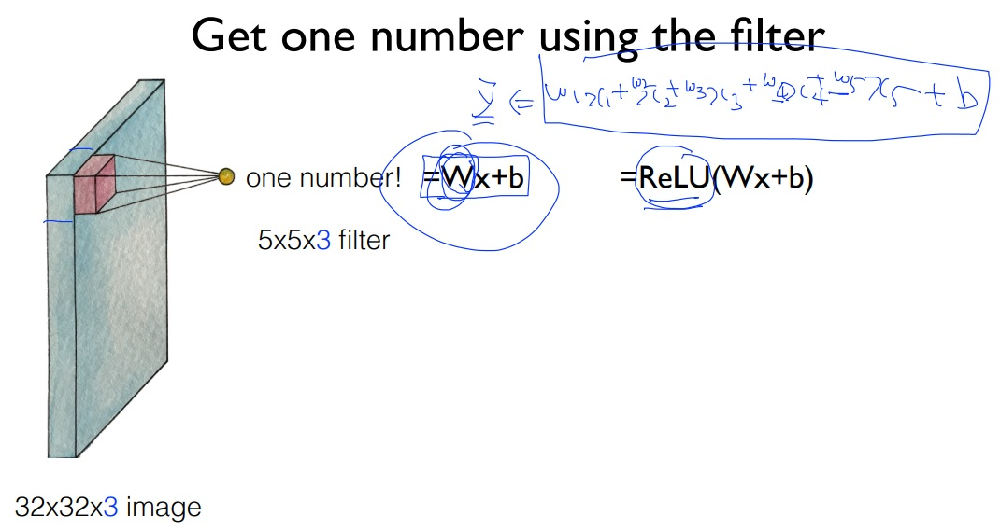  

stride가 1이라고 가정했을 때, filter의 갯수에 따라 출력맵의 갯수가 결정되는 것을 볼 수 있다.(필터의 갯수와 출력맵의 갯수는 동일)  
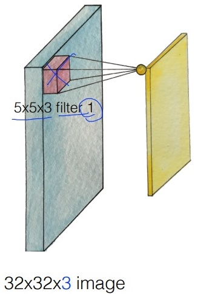
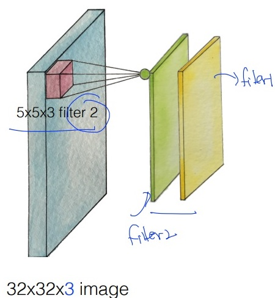
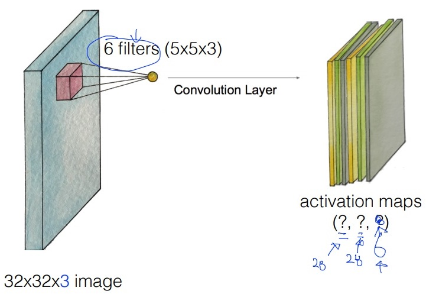

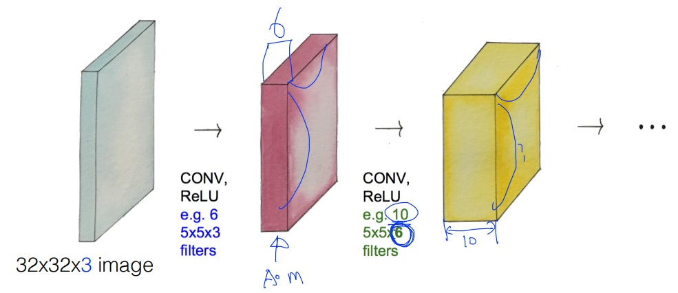  

- convolution연산 (filter computing)
convolution 연산의 계산은 아래와 같이 이미지의 픽셀 값과 필터의 각 원소들의 합으로 계산된다.
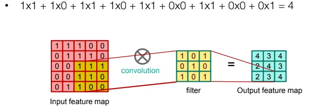

- convolution연산과 stride, padding
stride란 filter가 움직이는 간격의 크기를 의미한다.  
stride 값과 filter, input map의 크기에 따라 생성되는 출력 맵의 크기가 달라지게 되는데,  
출력되는 맵의 크기는 (width - filter width)/stride + 1이다.  
filter를 거치면서 out map의 크기가 점점 작아지게 되는데, 이로 인해 data의 손실이 일어날 수 있다.  
이를 방지하기 위해 padding을 사용하는데, 아래 그림처럼 filter의 크기에 따라 padding을 달리하면 outmap의 크기가  
input map의 크기와 같아지는 것을 볼 수 있다.  
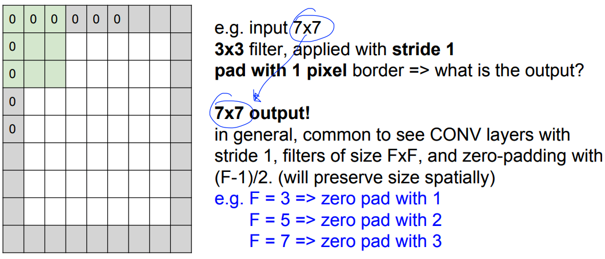  

## Activation
각 Conv layer를 거친뒤 다음 입력으로 입력되기 전에 Activation function을 거치는데 이 때, Relu를 사용한다.  
아래 그림처럼 Relu activation function으로 인해 음수 값들은 0이되고 양수 값들은 그대로 유지된다.  
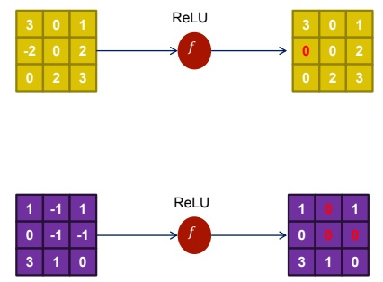  

## Pooling Layer
-----
Convolution layuer에서는 filter를 stride간격으로 convolution연산을 해서 output맵을 만들어낸다.  
아래의 그림을 보면 convolution연산을 거치면서 점점 이미지가 옅어지는 것을 볼 수 있다.  
Convolution 연산을 거치고 나온 맵에서 특징을 추출을 해야 하는데, 이때 사용하는 것이 pooling이라는 것이다.  
  
pooling연산은 '값들을 모은다', 'sampling한다', 'resize한다' 와 유사한 의미로 볼 수 있다.  
pooling연산을 하는 방법으로 두가지가 있는데, 맵의 평균값을 구해서 이 맵의 전체적인 특징을 뽑아내는 것과(average pooling)  
맵의 가장 큰 특징을 뽑아내기 위한 방법(max pooling)이 있다.  
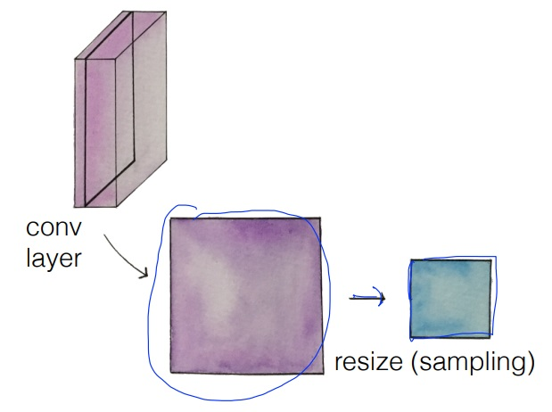
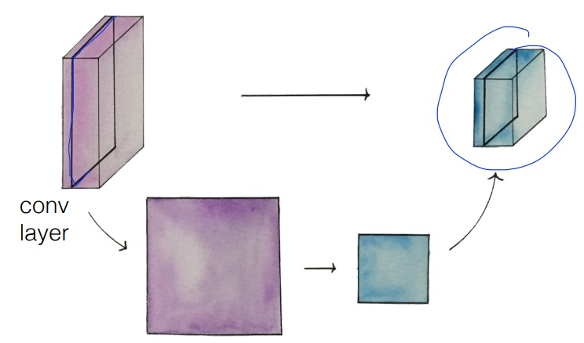  
  
max pooling의 실제 연산은 아래 그림처럼 filter가 stride간격으로 이동하면서 최대값을 구해서 out map을 구성한다.  
아래 그림에서는 2x2 filter를 2칸 간격으로 이동하면서 filter와 겹치는 영역에서의 최대값을 뽑아서 out map을 구성하고 있다.  
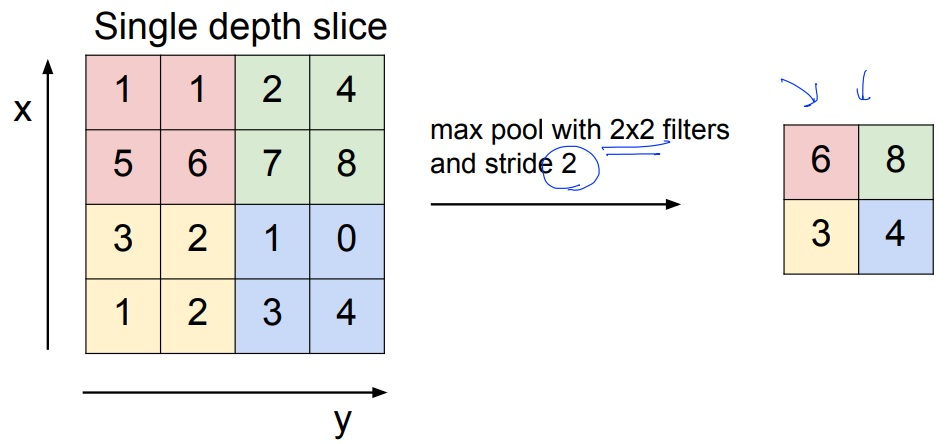  

## Fully Connected Layer
-----
Fully Connected layer에서는 Conv와 Max layer들을 통해서 나온 out map을 1차원으로 쭉 펼친다.  
그리고 Softmax activation function을 통해 분류(classification)를 하게 된다.  
아래 그림을 보면 FC Layer를 통해서 cat/dog로 분류되는 것을 볼 수 있다.  
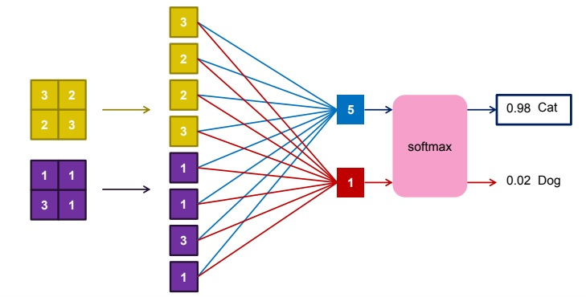

## 그 외의 참고사항
 - CNN에서 layer의 갯수에 FC는 포함되지 않는다.  보통 layer의 갯수는 Conv layer의 갯수를 말한다.  
 - 아래 링크에서 이미지의 특징들이 어떻게 출력되는지 과정을 살펴볼 수 있다.  
    http://cs.stanford.edu/people/karpathy/convnetjs/demo/cifar10.html