# Recurrent Neural Network
RNN(Recurrent Neural Network)는 연속적인 데이터를 예측하기 위한 모델이다.  
또, RNN에는 몇가지 단점이 있어서 이를 보완하기 위한 모델로 LSTM과 GRU와 같은 모델이 있다.  
LSTM과 GRU에 대해서는 다음 장에서 살펴보기로 하고 RNN을 집중적으로 살펴보자.
여기서는 단어를 예로 들어서 RNN의 동작 원리에 대해 심플하게 설명하고 있다.  
  
# dataset
deeplearning은 이미 가지고 있는 데이터를 학습해서 실제 데이터에서 다음 값을 예측하거나 분류를 하는 것이 목표이다.  
학습을 위해서 사용하는 데이터는 데이터에 대한 라벨(정답)이 있는 데이터셋을 사용한다.  
여기서는 주로 단어예측과 관련된 내용을 설명하는데, 단어에 대한 라벨링(이진 값으로 변환)을 '원 핫 인코딩'을 하여 만든다.  
원핫인코딩을 하는 방법도 두가지로 나눌 수 있다. 단어 단위로 하거나 문자 단위로 하는 것이다.  
또, 원핫인코딩 대신 단어임베딩이라는 것도 많이 사용되는데, 단어임베딩은 메모리를 더 적게 쓰면서 더 빨리 값을 가져올 수 있다는 장점이 있다.  
각 단어에 대한 값이 이진으로 코딩되어 있는 대신, 해시알고리즘을 사용해서 값을 더 빨리 찾을 수 있기 때문이다.  
이런 방법에 대해서는 다음 챕터에서 더 자세히 살펴보고 여기서는 원핫인코딩을 사용해서 문자 중심의 예측을 위한 rnn을 더 집중적으로 살펴보자.  

# RNN이란..
아래 그림에서 볼 수 있듯이 현재의 입력에 대한 출력이 다음 입력으로 사용되는 것을 볼 수 있다.  
오른쪽의 그림을 보자.  
X입력을 받고 이 데이터에 대한 상태인 h가 다음 모델의 입력으로 입력되는 구조를 보여주고 있다.  
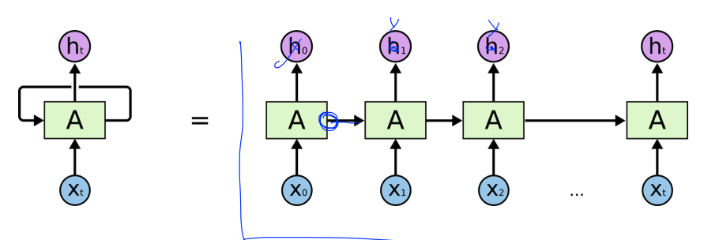  

## h에 대해 살펴보면..    
입력을 받을 때마다 상태에 해당하는 h가 갱신되는데, 이를 수식으로 살펴보면 아래 그림과 같다.  
h는 새롭게 갱신될 new state를 의미한다.  
fw라는 함수에 이전 h(state)와 현재 입력값이 입력되어서 현재의 h가 갱신되고 있다.  
fw란 weight값을 가진 어떤 함수를 의미하는데, 이 함수는 다음 그림에서 더 자세히 살펴보자.  
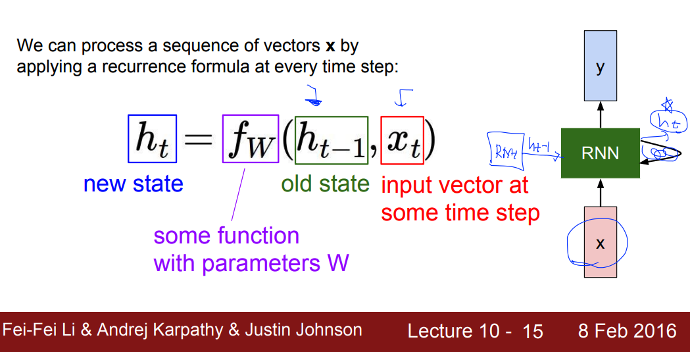  

## fw함수가 뭔지 더 자세히 보면..  
아래 수식을 보면 fw함수는 이전의 h(state)에 weight를 곱한 값과 x에 weight를 곱한 값을 activation함수(tanh함수)에 넣는 것을 볼 수 있다.  
tanh함수는 activation함수로 -1에서 1사이의 값을 가지고 기존의 sigmoid에 비해 vanishing gradient문제가 해결된 함수다.  
결국, 이 fw함수로 현재의 h함수를 업데이트되는 것이다.  
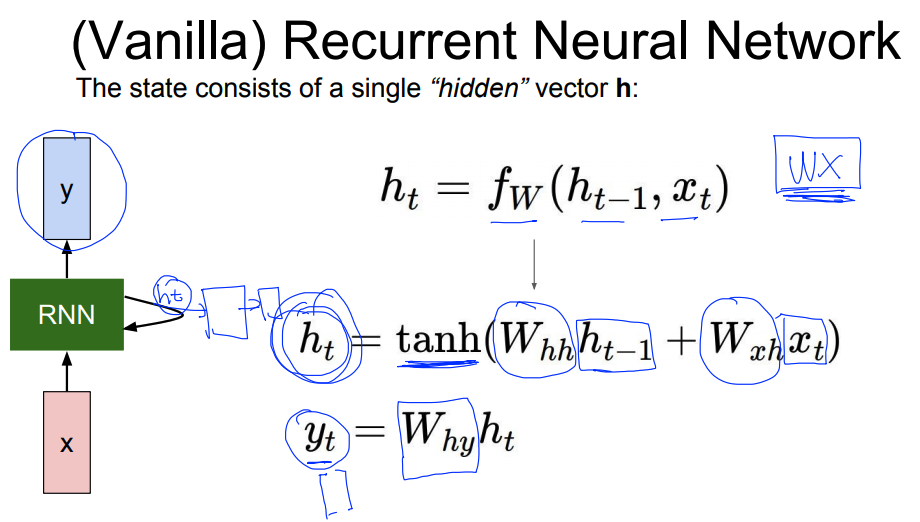  

## hidden layer
h는 상태를 의미하지만 rnn모델에서 hidden layer를 의미하기도 하는데,  
아래 그림들을 보면 매 step마다 입력에 대해 h(hidden layer)가 업데이트되는 것을 볼 수 있다.  
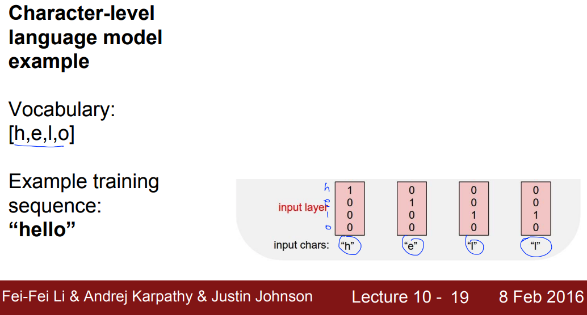  
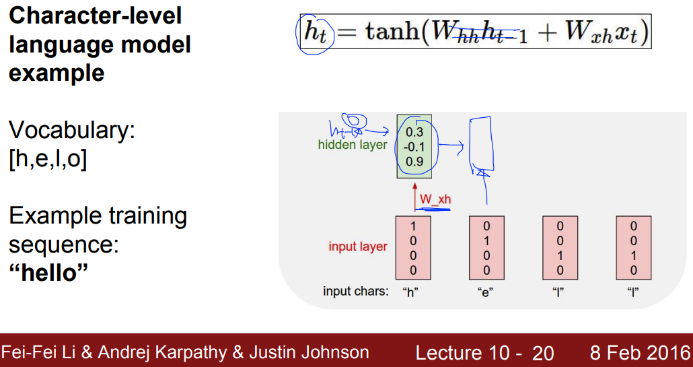
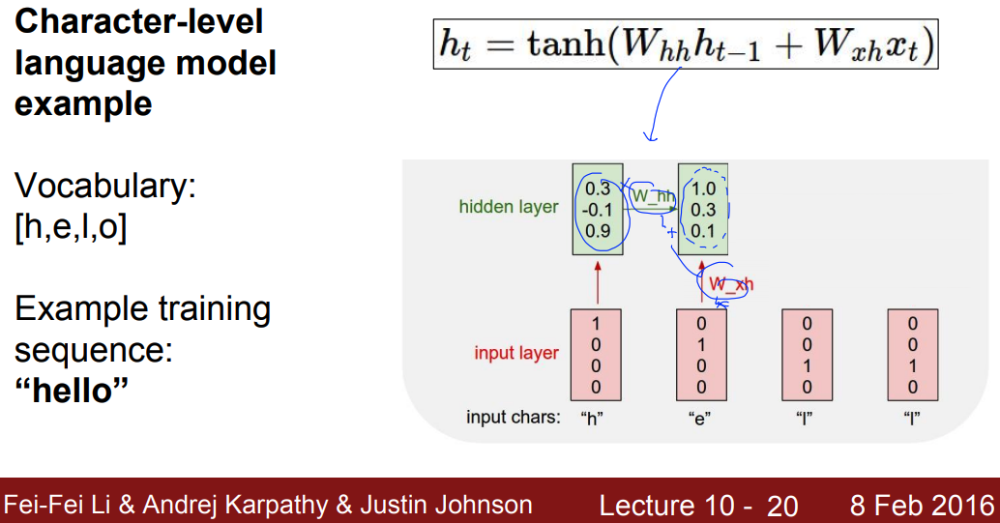
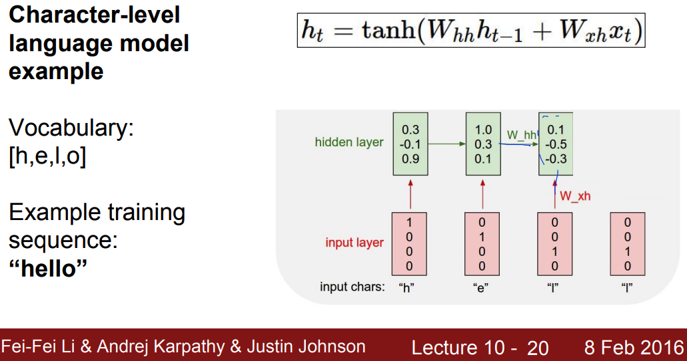
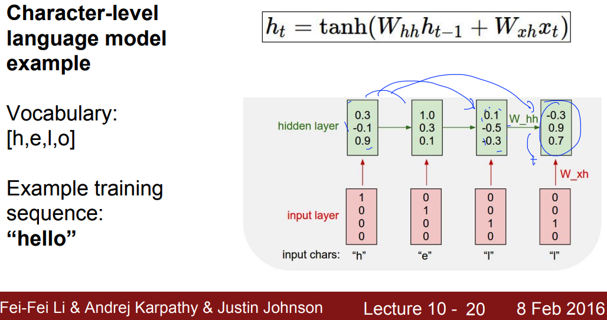  
  
## output layer
output layer에서는 hidden layer를 통해 나온 현재의 h값(state)에 weight값을 곱해서 outlayer의 값이 출력되게 된다.  
이 슬라이드 상에는 나오지 않았지만, 각 단어의 확률값을 출력하기 위해서 softmax를 activation function으로 사용한 것으로 보인다.  
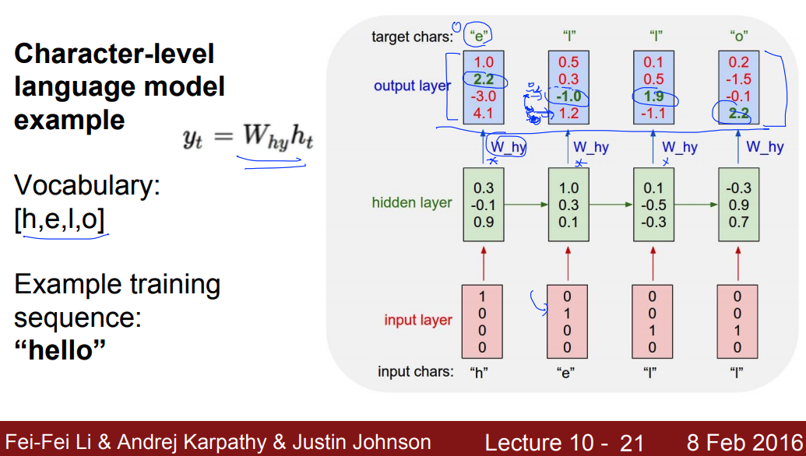  

## rnn 모델의 종류
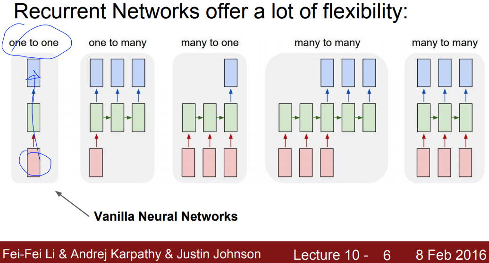  
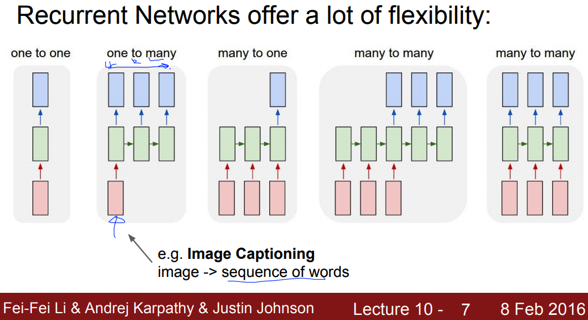  
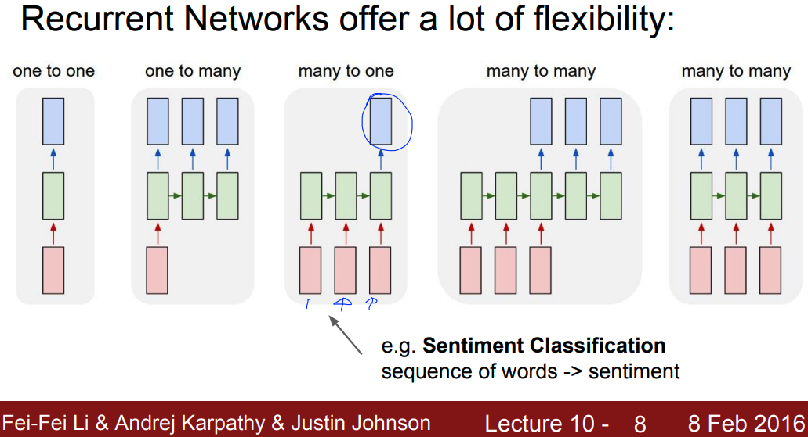  
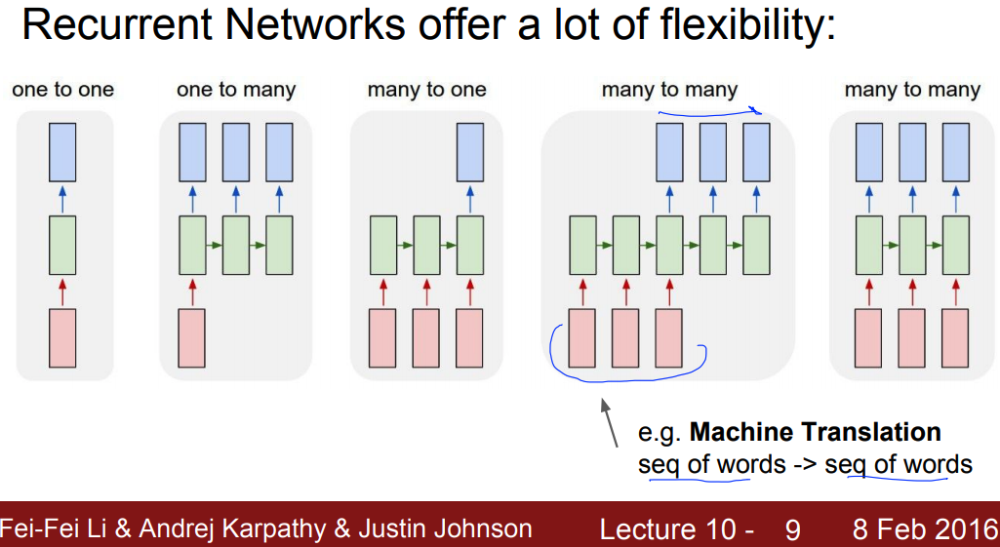  
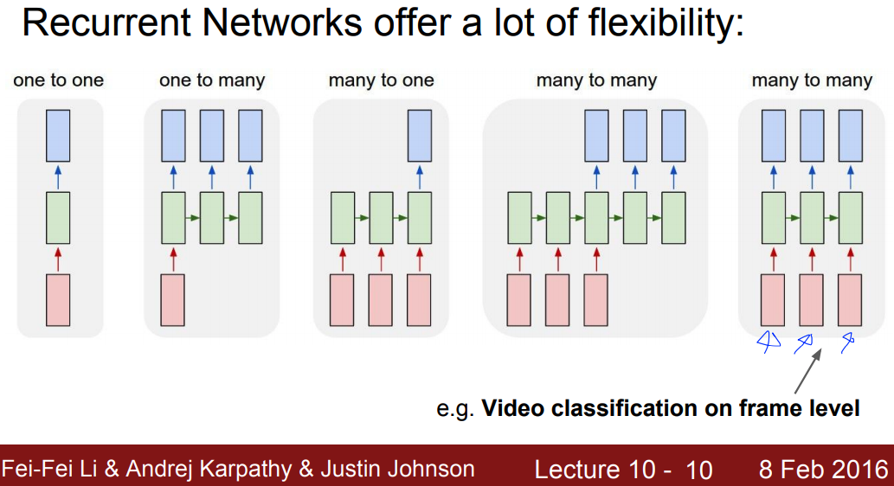  
  
## advanced rnn models
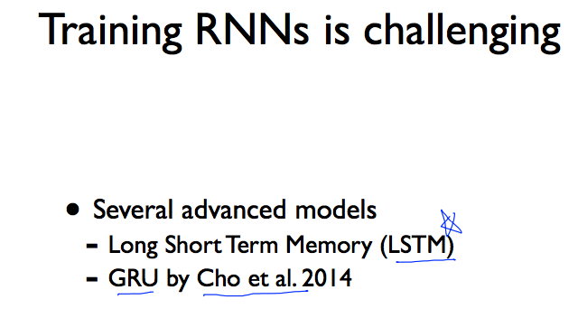  
