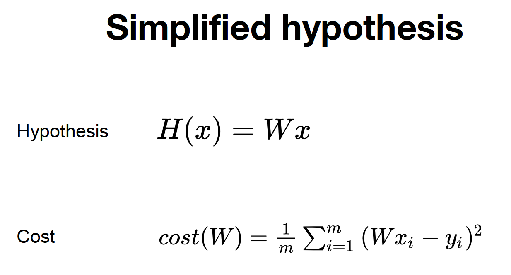
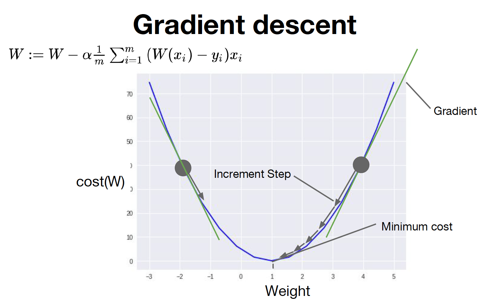
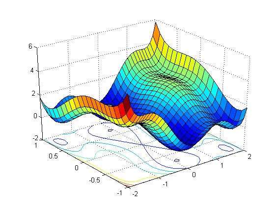
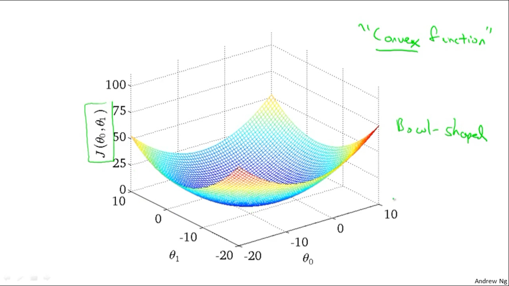

# [Tensorflow] Lec-02 ~ 03 Linear Regression
 - Regression
 - Linear Regression
 - Hypothesis
 - Which hypothesis is better?
 - Cost, Cost function
 - Goal: Minimize cost

## Regression
회귀, 모든 데이터들은 평균으로 회귀하려는 속성을 갖는다. 통계학쪽에서 유명한 말인듯하다..뭔소리야..

## 선형회귀
데이터를 가장 잘 대변하는 직선의 방정식을 찾는 것

## Hypothesis
데이터를 표현하는 직선 방정식
H(x) = Wx+b

## Whichi Hypothes is better
실제 데이터와 가설과의 차이, cost를 최소화된 가설..
코스트의 합이 최소인 직선을 찾는다.

## cost, cost function
가설에서 실제데이터를 뺀 값을 에러라고 하고
cost function은 에러의 제곱을 평균값을 cost function이라고 한다.  
  

## Goal: Minimize cost

# Simple Linear Regression 개념

## Build hypothesis and cost
H(x) = Wx + b
예제 코드 상에서 간단한 형태의 코드를 보기 위해 W, b의 값은 초기 값으로 임의의 값을 지정한다.
실제로는 보통 random값을 부여한다.

reduce_mean(): 평균값 구하는 함수, 차원이 하나 줄어들면서 mean을 구한다는 의미로 reduce가 앞에 붙어있다.
~~~python
v = [1., 2., 3., 4.]
tf.reduce_mean(v) #2.5
~~~

비용함수
~~~python
cost = tf.reduce_mean(tf.square(hypothesis - y_data))
~~~
-----
## Gradient descent
 - 경사를 내려가면서 cost가 최소가 되는 W, b를 찾는 알고리즘.
-----
### W, b 값 구하기
 - tf.GradientTape
    with 구문안의 블록안의 변수들의 정보를 tape에 기록
    tape에 기록된 변수들의 정보(w,b)를 이후에 tape.gradient()함수를 통해 경사도를 구한다.
    tape.gradient()함수는 cost함수에 대해 변수들(w,b)에 대한 개별 미분값(기울기)을 구해서 tuple을 반환한다.
    learning rate값은 W_grad, b_grad 값을 얼만큼 반영할 것인지를 결정한다.
    아래의 코드가 한 걸음이라고 보면 됨, W와 b가 한번 업데이트 된 것이다.
~~~python
with tf.GradientTape() as tape:
    hypothesis = W * x_data + b
    cost = tf.reduce_mean(tf.square(hypothesis - y_data))

W_grad, b_grad = tape.gradient(cost, [W, b])

# W, b 값 업데이트: W -= learning_rate * W_grad
W.assign_sub(learning_rate * W_grad)
b.assign_sub(learning_rate * b_grad)
~~~

# [Tensorflow] Lab-02 Simple Linear Regression
 구현 예를 보자.

=====
## Build hypothesis and cost
H(x) = Wx + b
예제 코드 상에서 간단한 형태의 코드를 보기 위해 W, b의 값은 초기 값으로 임의의 값을 지정한다.
실제로는 보통 random값을 부여한다.

reduce_mean(): 평균값 구하는 함수, 차원이 하나 줄어들면서 mean을 구한다는 의미로 reduce가 앞에 붙어있다.
~~~python
v = [1., 2., 3., 4.]
tf.reduce_mean(v) #2.5
~~~

비용함수
~~~python
cost = tf.reduce_mean(tf.square(hypothesis - y_data))
~~~
-----
## Gradient descent
경사를 내려가면서 cost가 최소가 되는 W, b를 찾는 알고리즘.

-----
### W, b 값 구하기
 - tf.GradientTape
with 구문안의 블록안의 변수들의 정보를 tape에 기록
tape에 기록된 변수들의 정보(w,b)를 이후에 tape.gradient()함수를 통해 경사도를 구한다.
tape.gradient()함수는 cost함수에 대해 변수들(w,b)에 대한 개별 미분값(기울기)을 구해서 tuple을 반환한다.
learning rate값은 W_grad, b_grad 값을 얼만큼 반영할 것인지를 결정한다.
아래의 코드가 한 걸음이라고 보면 됨, W와 b가 한번 업데이트 된 것이다.
~~~python
with tf.GradientTape() as tape:
    hypothesis = W * x_data + b
    cost = tf.reduce_mean(tf.square(hypothesis - y_data))

W_grad, b_grad = tape.gradient(cost, [W, b])

# W, b 값 업데이트: W -= learning_rate * W_grad
W.assign_sub(learning_rate * W_grad)
b.assign_sub(learning_rate * b_grad)
~~~
-----

### cost는 어떻게 줄일까?
How to minimize cost(Gradient Descent)
  

 - Error : H(x) - y

 - cost : (H(x)i - yi)의 제곱의 평균값

 - Gradient Descent: cost 함수의 최소값을 찾는 알고리즘으로 Gradient Descent알고리즘을 사용한다.  
    최적화?.. 이득을 최대화하거나 손실을 최소화한다 -> gradient descent알고리즘은 손실을 최소화한다.  
     W1, W2, W3.. 등 변수가 여러개 있을 경우에도 손실을 최소화시킬 수 있는 알고리즘이다.  

 - Gradient Descent 알고리즘은 어떻게 동작하는가?
    - 최초의 추정을 통해 W, b 값을 초기화한다.(0,0 또는 random값 등 최초의 초기화된 값)  
      cost가 최소가 될 수 있도록 지속적으로(매 스텝마다) W,b값을 조금씩 바꾼다.
    - W, b 값을 지속적으로 업데이트할 때, Gradient값을 구해서 cost값이 최소화되는 방향으로 업데이트한다.
    - 위의 두 과정을 반복한다.
    - 최소값에 도달했다고 판단될때까지..
    - 아래 그림을 참고..

      

- 위 그림의 수식에서처럼 W값에 기울기*x값 *learningrate값을 빼서 이동하는 과정이 Gradient descent가 된다.

- local minimum, convex function

  

  위 그림 처럼 주변 값들에 비해 cost값이 작은 값을 local minimum이라고 한다.

  Local minimum값이 여러개 존재하기 때문에 gradient descent 알고리즘을 사용할 수 없다.
  cost function이 아래 그래프와 같이 local minimum과 global minimum이 일치할 때, gradient descent 알고리즘을 사용할 수 있다.
    

  

- 