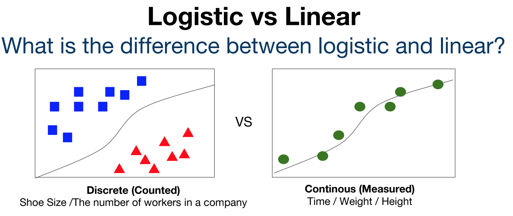
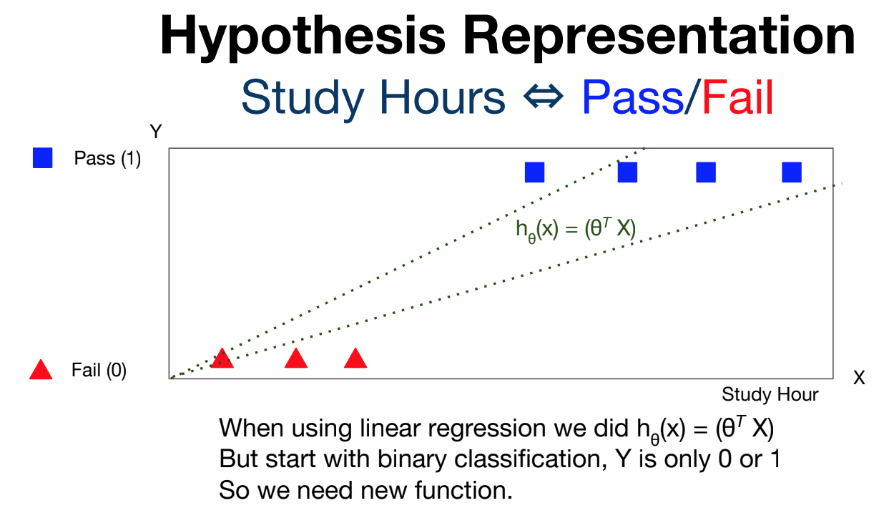
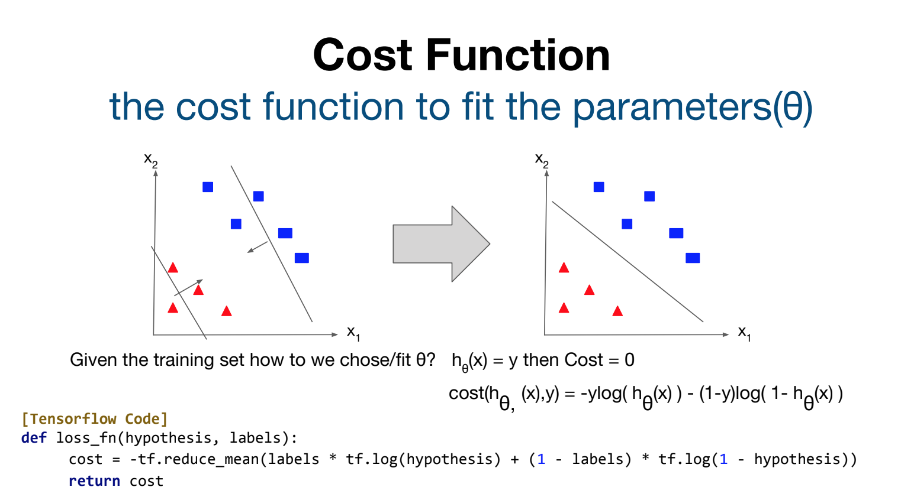
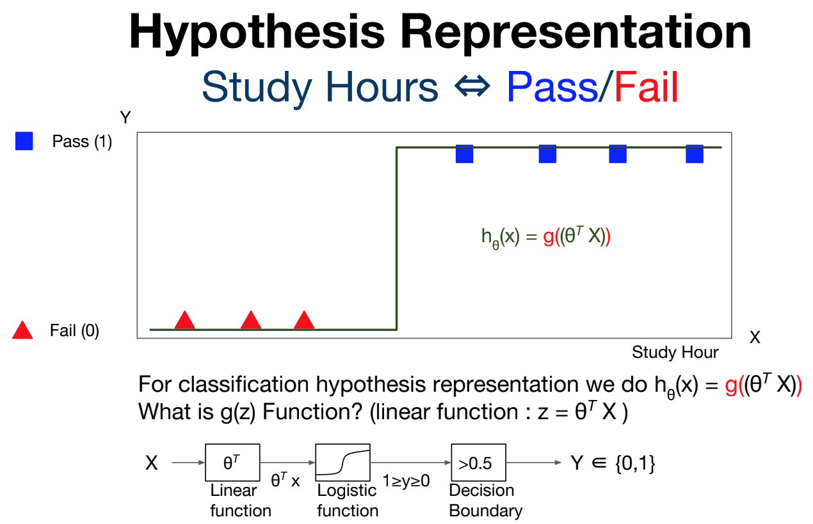
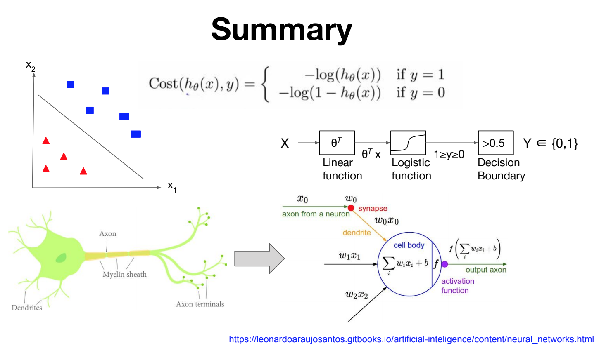
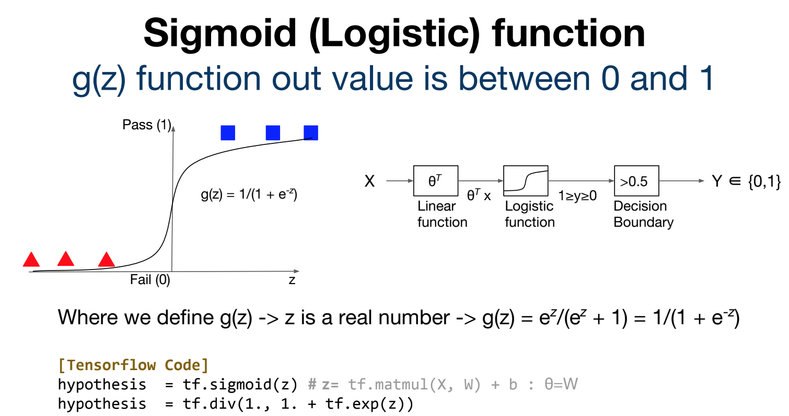

# Logistic regression

## Logistic Regression이란?(logistic vs linear)

logistic regression은 선형적인 값에 대한 예측을 하기위한 모델인 Linear Regression과 달리  

분류(classification)을 하기 위한 것이다.

- Linear regression
  아래 그림의 우측을 보면 linear regression의 경우 곡선, 직선을 따라서 데이터들이 표현되어 있다.
  이 곡선,직선의 방정식?그래프를 모델이 학습하게 된다. 학습을 하는 원리에 대해서는 이전 챕터 1,2 참조하면 됨.(cost, w, b, learning rate)
- Logistic regression
  이름처럼 선형적인 것이 아니라 논리적인 것이다. 아래 좌측의 그림처럼 네모와 세모를 분류하기 위한 모델이다.
  네모와 세모 중간에는 곡선이 하나 있는데 이 곡선을 기준으로 네모인지 세모인지 판단할 수 있게 된다.
  마찬가지로 이 곡선도 학습할 수 있는데, 어떻게 학습하는지에 대해 살펴보자.
- 분류의 문제의 경우 여기서는 이진분류(binary classification)만을 다루지만 다음챕터에서 multinomial classification을 통해 T/F만이 아닌 다양한 라벨로 분류하는 방법을 살펴보게 될 것이다.

## Hypothesis

- 두 가지 경우로 나눌 수 있다.
  점들을 그룹들로 나누는 모델, 그래프에서 값이 일정 수치 이상일 경우 True/False(Pass/Fail)을 예측할 수 있는 모델로 나눌 수 있다.

- 점들을 그룹으로 나누는 모델
  위의 그림처럼 네모와 세모를 경계짓는 곡선들의 경우 Binary Regression을 통해 True/False 를 판단할 수 있다.
  이 경우, 두 그룹 간의 직선(또는 곡선)이 Hypothesis가 되는데, 
  이는 이전 챕터에서 배웠던 것과 같이 가설(Hypothesis)과 실제 데이터(y) 간의 거리를 구하는 cost 함수를 사용해서 cost를 최소화되는 곡선을 찾고, 이 결과로 분류가 가능하다.
  
  

  

- 일정 수치 이상일 경우 True/False를 판단하는 모델
  예를 들어 y = x+b의 직선이 있고 이 직선은 공부시간(x)에 대한 시험성적(y)에 대한 직선이라고 해보자.

  시험 성적이 50이하일 경우, Fail, 50이상일 경우 Pass라고 하면, pass, fail을 표현하는 그래프는 아래와 같이 계단 모양이 될 것이다. 아래 그래프는 가설을 Sigmoid함수의 입력으로 주면 아래와 같은 그래프 형태가 된다.

  
  

  

- 시험성적 뿐 아니라, 혈당 수치에 대한 당뇨 확률? 이건 너무 당연한 비유겠지만.. 또는 한달 평균 운동 시간에 대한 비만 확률? 같은 경우에도 사용할 수 있지 않을까..

## sigmoid function 

슬라이드로 살펴보자..

## Softmax classification

Sigmoid 대신 Softmax를 사용하면 0또는 1로 분류하는 이진분류가 아닌 다수의 라벨로 분류할 수 있다.