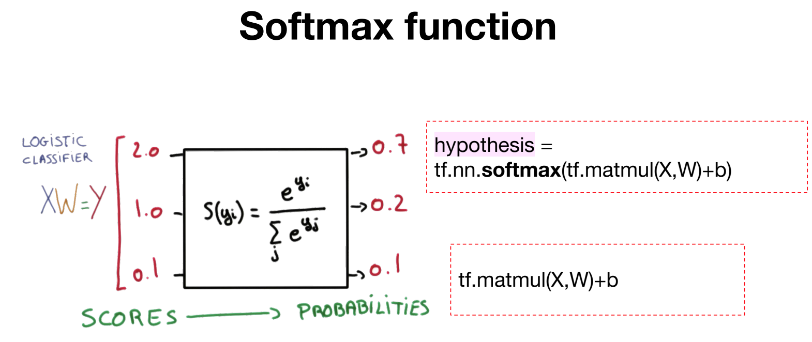
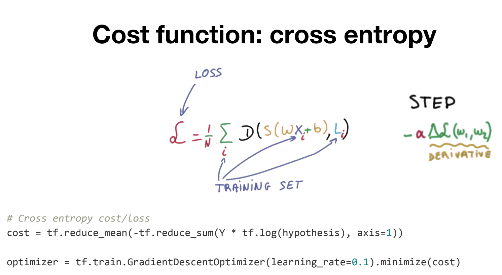
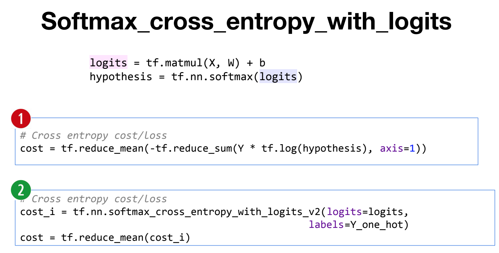
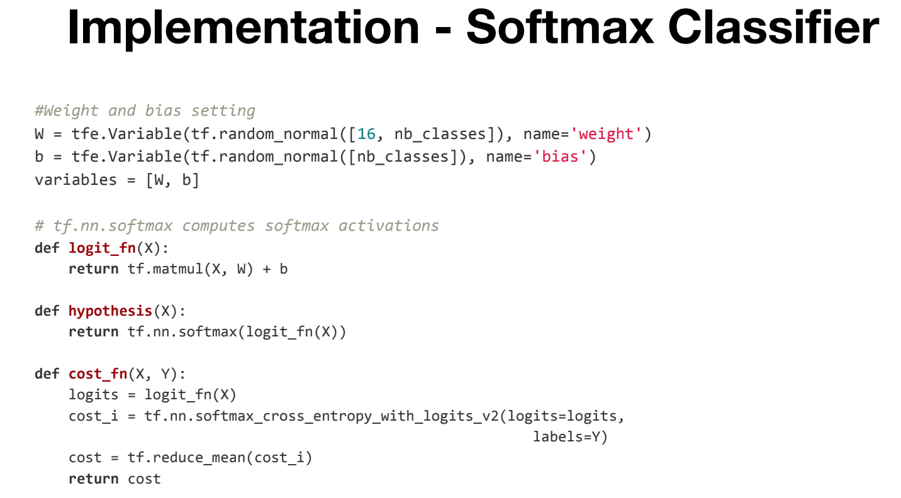
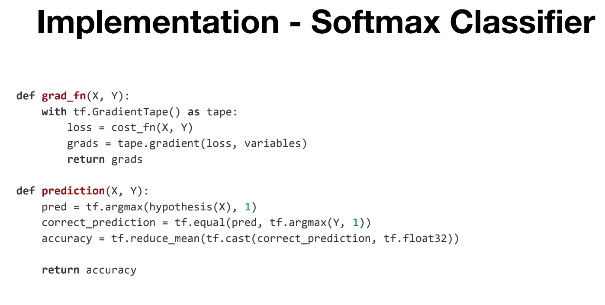
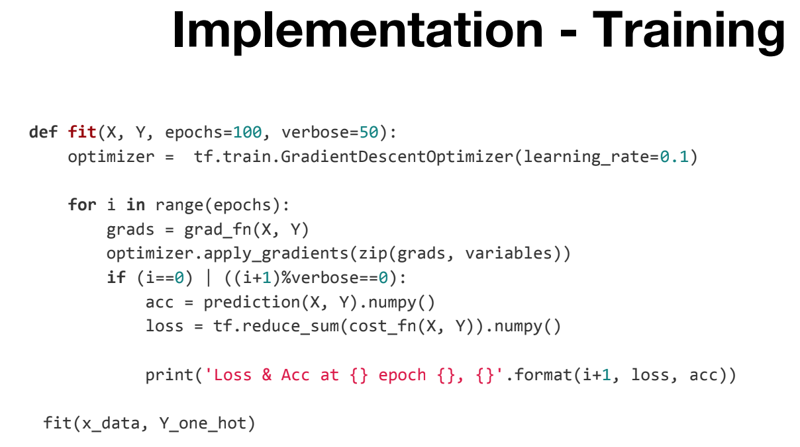

# Softmax function
Softmax function은 다중 분류를 하기 위한 함수로 H(x)를 확률 값으로 표현해준다.  
아래 그림에서 볼 수 있듯이 각각의 입력을 확률로 바꿔주고 있다.  
  
  
## Cost function  
Softmax의 Costfunction으로는 cross entropy를 사용한다.  

## Implementation

### cost function: cross entropy

### H(x), cost function

### gradient function, accuracy

## Training !!!!

