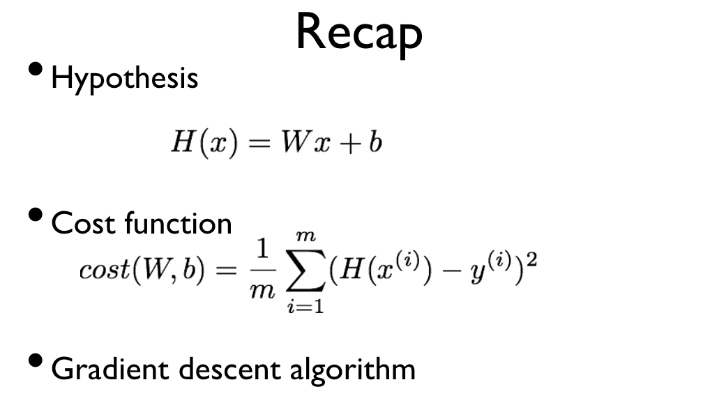
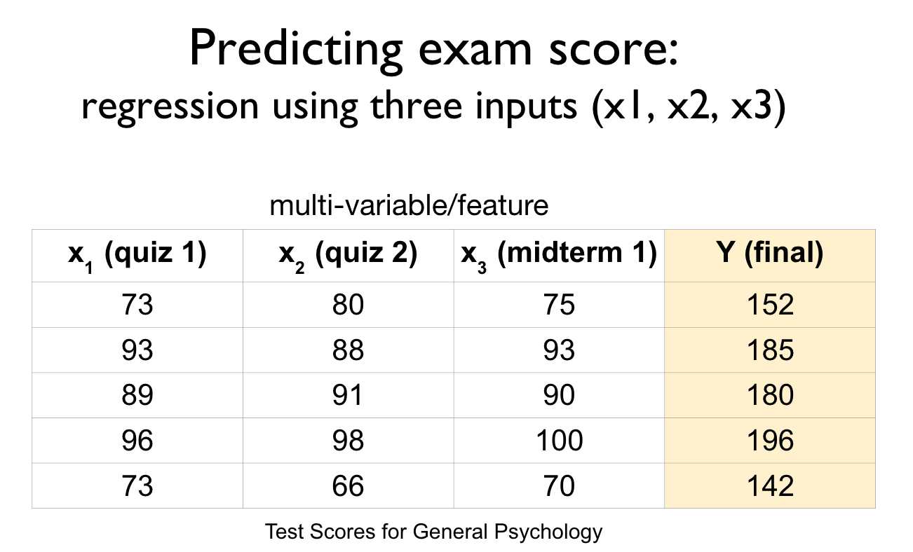
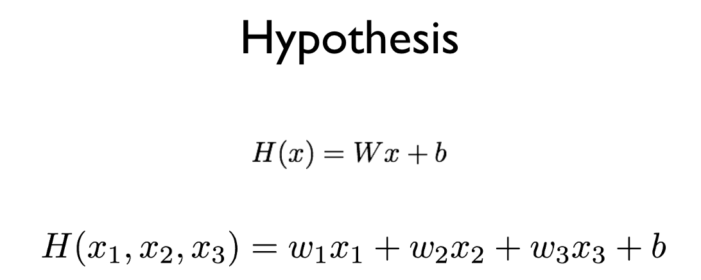
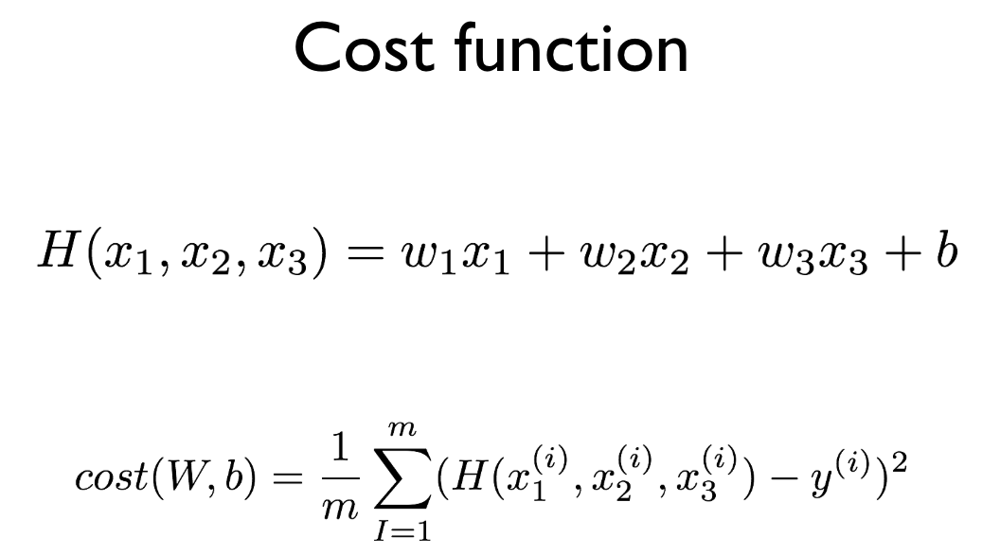
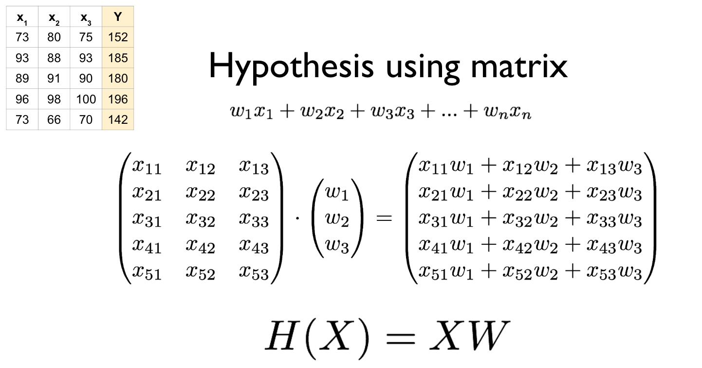

~~~
이 포스트는 홍콩과기대 김성훈 교수님 강의내용을 개인적으로 이해한대로 정리한 내용입니다.  
개인적인 호기심으로? 스터디한 내용을 정리한 포스팅입니다.  
틀린 부분이 있을 수 있으니 감안하시길 .. 아래 사이트에 강의 내용이 있습니다.
~~~
[모두를 위한 딥러닝 강의](http://hunkim.github.io/ml/)  
[모두를 위한 딥러닝 깃허브](https://github.com/hunkim/DeepLearningZeroToAll)  

# remind.. 

H(x)란(가설).. 
어떻게 예측할 것인지를 의미.. 
(경사하강법을 통해서 cost function(비용함수)를 최소화하는 최적의 H(x)를 찾고, 이 H(x)를 통해서 다음에는 어떤 값을 가질 것인지를 예측할 수 있다.)  

cost function(비용함수)이란..  
실제 통계 등의 데이터와 H(x)값이 얼마나 차이나는지를 의미
  
gradiant descent algorithm(경사하강법)이란..  
x축이 w이고 y축이 cost function인 그래프를 생각해보자.  
결국 w값을 조정해가면서 cost function의 최소값을 찾는 방법이다.  
이렇게 찾는 방법이 기울기(w)를 하강시켜가면서 0이 되는 지점을 찾는 것이기 때문에 경사하강법이라 부르는 듯..  
경사하강법을 사용하기 위한 전제?가 있는데.. cost function이 convection function(아래로 볼록한 함수)의 형태이어야한다는 것..  
<left></left>

# 입력이 여러개일 경우는..
아래 그림 처럼 입력데이터 셋이 여러개(quiz1, quiz2, midterm) 일 경우에는 어떻게 Cost function을 계산할 것이며, cost function을 최소가 H(x)는 어떻게 찾을 것인가..
<left></left>
  
  
우선 H(x)는 아래와 같은 형태일 것이다.
<left></left>

cost function은 아래와 같은 형태일 것이다.
<left></left>
  
그런데, 행렬을 사용하면 H(x)를 입력값의 추가 및 수정이 편한 형태로 바꿀 수 있다.  
<left></left>

이제 w값을 변경해가며 cost function이 최소가 되는 값을 찾으면 된다.
이는 경사하강법을 사용해서 찾으면 된다..

